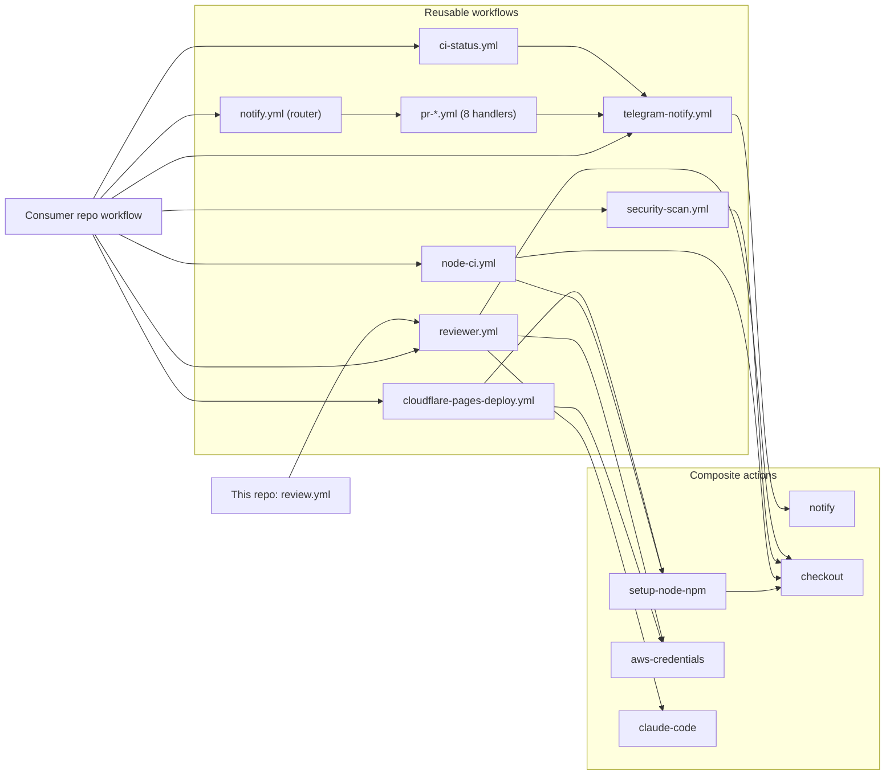

# Architecture

This repo holds the CI building blocks that every `domengabrovsek` repo shares. Consumer repos reference them at `@main`, so one merge here changes CI everywhere. This page covers the parts, how they call each other, the reasons behind the design, and how to change a part safely.

## The parts

The repo has three kinds of files. A caller can use any action or reusable workflow on its own, in any combination.

| Kind | Location | How a caller uses it | Docs |
| --- | --- | --- | --- |
| Composite action | `.github/actions/<name>/action.yml` | As a step: `steps: - uses: domengabrovsek/github-actions/.github/actions/<name>@main` | [`docs/actions/`](actions) |
| Reusable workflow | `.github/workflows/<name>.yml` with `on: workflow_call` | As a whole job: `jobs.<id>.uses: domengabrovsek/github-actions/.github/workflows/<name>.yml@main` | [`docs/workflows/`](workflows) |
| This repo's own workflow | `pull-request.yml`, `review.yml` | Runs on this repo's own events. Nothing calls it. | This page |

Composite actions come in three groups:

- **Wrappers** re-declare one third-party action's inputs and pin it to a SHA: `checkout`, `aws-credentials`, `setup-opentofu`, `setup-terraform`, `upload-artifact`, `download-artifact`, `markdownlint`, `claude-code`.
- **Bundles** combine steps: `setup-node-npm` runs checkout, `actions/setup-node`, and a hardened `npm ci`.
- **Sender**: `notify` renders and sends the standard Telegram message. See [notifications](workflows/notifications.md).

## How the parts connect

Reusable workflows call composite actions by their `@main` path, and composite actions call each other the same way. Nothing under `.github/` uses a local (`./`) reference.

This repo does not call `notify.yml` itself. A GitHub repo webhook, managed by the home-infra repo's github stack, sends its PR, review and comment events to the telegram-notify-bot Lambda, which posts the Telegram messages. That path sends no ping for pushes to an open PR (`synchronize`).

The diagram shows who calls whom. [README.md](../README.md) lists every workflow and action with a one-line summary, and the eight `pr-*.yml` handlers are listed in [notifications](workflows/notifications.md#events).

The notification chain is the deepest. It runs the consumer's workflow, `notify.yml`, a `pr-*.yml` handler, `telegram-notify.yml`, then the `notify` composite action. That is four levels of workflows, counting the caller's top-level workflow, out of the ten GitHub allows ([GitHub docs](https://docs.github.com/en/actions/how-tos/reuse-automations/reuse-workflows#nesting-reusable-workflows)). `telegram-notify.yml` formats and sends in one job, because GitHub bills every job for at least one minute and a separate send job would double the cost of each message. Wrappers not shown in the diagram (`setup-opentofu`, `setup-terraform`, `upload-artifact`, `download-artifact`, `markdownlint`) have no caller in this repo. Consumer repos use them directly.

## Design decisions

| Decision | Why | Source |
| --- | --- | --- |
| Callers reference `@main` | A fix or version bump merged here reaches every consumer with no edit in the consumer repos. A bad merge also reaches every consumer at once. A caller that needs a fixed version pins a tag or SHA instead. | `README.md` |
| Third-party actions are pinned to a full commit SHA with a `# vX.Y.Z` comment | A moved or compromised tag cannot change the code that runs. | Every `uses:` under `.github/` |
| Each common third-party action has one wrapper | A version bump is one edit in the wrapper. Scanners that only `security-scan.yml` or `node-ci.yml` use are pinned inline there instead. `actions/github-script` is pinned in both `.github/actions/notify/action.yml:71` and `.github/workflows/pr-updated.yml:28`. | `.github/actions/*/action.yml`, `.github/workflows/security-scan.yml:72-107` |
| Checks share one job where possible | GitHub bills every job for at least one minute. `node-ci.yml` runs every check as a step in one job. `security-scan.yml` runs gitleaks and Bearer in one job. The `notify` action lets a job that already exists send a message without starting a second job. | `.github/workflows/node-ci.yml:4-9`, `.github/workflows/security-scan.yml:54-58`, `.github/actions/notify/action.yml:2-5` |
| Tokens come from AWS SSM through OIDC, not repo secrets | No repo stores the Claude or Cloudflare token. A job assumes an AWS role and reads the token at run time. | `.github/workflows/reviewer.yml:13-18`, `.github/workflows/cloudflare-pages-deploy.yml:4-6` |
| One formatter renders every Telegram message | Callers pass typed fields and pick a layout with `event_type`. No input takes a whole message body, so every message gets the same header, labels and field order, and a layout change is one edit. | `.github/workflows/telegram-notify.yml:1-7`, [notifications](workflows/notifications.md#formatter-telegram-notifyyml-and-the-notify-action) |
| Notification callers may use `pull_request_target` | Fork PRs cannot read `vars.*` under `pull_request`. This is safe because no job in the chain checks out or runs PR code. | `docs/workflows/notifications.md:44` |
| `review.yml` calls `reviewer.yml@main`, not `./` | The `github-reviewer` AWS role trusts only `reviewer.yml` from `main`. A local call on a pull request would present the PR ref. | `.github/workflows/review.yml:4-6` |
| Every managed repo has a check named `Gate` | The home-infra repo manages branch protection for a set of repos (the managed repos) and requires one `Gate` check in each. This repo has no CI of its own, so its `Gate` always passes. `node-ci.yml` has no gate, because consumers add it to their own `Gate` job. | `.github/workflows/pull-request.yml:3-5`, `.github/workflows/node-ci.yml:12-13` |
| Extra checks are opt-in | `actionlint` defaults to `false`, so repos with existing warnings keep passing. `iac_scan` defaults to `false`, because most consumers ship no IaC. | `.github/workflows/node-ci.yml:89`, `.github/workflows/security-scan.yml:85-86` |
| `npm ci` runs with `--ignore-scripts --no-audit --no-fund` | Dependency install scripts never run in CI, which blocks one supply-chain attack path. The audit and funding calls add network time and log noise with no use in CI. | `.github/actions/setup-node-npm/action.yml:42-44` |

## Making a safe change

A pull request here runs almost none of the code it changes:

- `pull-request.yml` only echoes a message. No lint or test runs on this repo.
- `review.yml` calls `reviewer.yml@main`, so the review uses the merged version.
- No workflow here calls `notify.yml`, the handlers or `telegram-notify.yml`, so a pull request never runs the notification chain.

A change therefore takes effect for every consumer when it merges. To try it first, point a test job in a consumer repo at your branch, for example `uses: domengabrovsek/github-actions/.github/workflows/node-ci.yml@<branch>`. Calls inside that workflow still resolve to `@main`, so only the top-level file runs from your branch. To test a nested file, call it directly at your branch: for example a `pr-*.yml` handler or `telegram-notify.yml` as a job, or a composite action such as `notify` as a step. `reviewer.yml` cannot run from a branch, because its AWS role trusts only `main`.

Check each change against callers:

- Adding an input with a default keeps every caller working.
- Removing or renaming an input, output, or job name breaks callers that use it. A renamed job also changes the status check name that branch protection may require.
- To bump a pinned action, edit the SHA and version comment in its wrapper or workflow.
- Update the matching page under `docs/` in the same pull request.

## Where things live

| Path | Contents |
| --- | --- |
| `.github/actions/` | Composite actions, one directory each |
| `.github/workflows/` | Reusable workflows and this repo's own workflows |
| `docs/actions/` | One page per wrapper or bundle action. The `notify` action is in `docs/workflows/notifications.md`. |
| `docs/workflows/` | One page per reusable workflow. `notifications.md` covers the whole notification family: `notify.yml`, the `pr-*.yml` handlers, `ci-status.yml`, `telegram-notify.yml`, and the `notify` action. |
| `README.md` | Index of every action and workflow |
